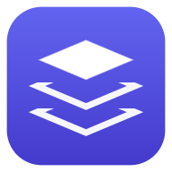

<div align="center">



# ProjectNotes

**Tu espacio de trabajo local para proyectos, notas, tareas, reuniones y transcripciones —
con búsqueda y asistente propios.**

Los datos son carpetas y ficheros markdown en tu disco. Nada de base de datos,
nada de nube obligatoria.

</div>

---

## Qué hace

- **Proyectos como carpetas.** Cada carpeta de `projects_data/` es un proyecto.
  Anídalas como quieras.
- **Notas en markdown**, con editor, vista previa y barra de formato.
- **Tareas** en `tasks.md` estándar, con vista agregada de todo lo pendiente.
- **Reuniones**: suelta un vídeo o un audio en la carpeta y transcríbelo con
  Whisper en local. La transcripción queda **navegable**: pulsa cualquier línea
  y la grabación salta a ese momento.
- **Búsqueda global** sobre el texto de todas las notas y transcripciones (`⌘K`).
- **Asistente** que responde sobre tu contenido **citando la fuente** — y el
  **minuto exacto** cuando lo dicho viene de una reunión. Funciona con
  proveedores gratuitos (Gemini, Groq) o en local con Ollama.
- **Instalable** en móvil, tablet y escritorio como PWA, con ruta documentada
  para generar un APK de Android.
- **Sincronización bidireccional** opcional con Google Drive. Los vídeos se
  quedan en local: a Drive van las notas, transcripciones y resúmenes.

---

## Puesta en marcha

```bash
git clone <este-repo>
cd ProjectNotes
npm install
npm run dev
```

Abre <http://localhost:3000>. Ya funciona: la búsqueda, las notas, las tareas y
todo el trabajo con ficheros no necesitan ninguna clave.

### Activar el asistente

```bash
cp .env.example .env.local
```

Y añade **una** clave. Hay opciones gratuitas:

| Proveedor | Coste | Clave |
|---|---|---|
| **Google Gemini** | Plan gratuito | <https://aistudio.google.com/apikey> |
| **Groq** | Plan gratuito | <https://console.groq.com/keys> |
| **Ollama** | Gratis y local | Ninguna: <https://ollama.com/> |
| Anthropic (Claude) | De pago | <https://console.anthropic.com/> |
| OpenAI | De pago | <https://platform.openai.com/api-keys> |

Puedes configurar varios y cambiar de modelo desde el propio chat. Sin ninguno
la app funciona igual; solo el chat queda desactivado, y la búsqueda sigue
operativa porque el índice léxico no usa la red.

Para ver qué modelos responden de verdad con tus claves:

```bash
npm run doctor
```

### Activar transcripción y resumen de reuniones

Necesitas `ffmpeg` en el `PATH` y un entorno de Python:

```bash
python3 -m venv venv
source venv/bin/activate           # Windows: venv\Scripts\activate
pip install -r requirements.txt
```

El resumen usa Gemini, así que añade también `GEMINI_API_KEY` a `.env.local`.

---

## Cómo organizar un proyecto

Crea una carpeta dentro de `projects_data/` y añade lo que necesites. Ningún
fichero es obligatorio.

```
projects_data/
└── Rediseño del portal/
    ├── description.md                              → pestaña Resumen
    ├── tasks.md                                    → pestaña Tareas y panel
    ├── links.md                                    → pestañas Enlaces y Documentos
    ├── talks.md                                    → pestaña Charlas
    ├── notas_arquitectura.md                       → pestaña Notas
    ├── images/                                     → pestaña Imágenes
    ├── kickoff.mp4                                 → pestaña Reuniones
    ├── kickoff_transcripcion.txt                   →   su transcripción
    ├── kickoff_transcripcion.json                  →   con marcas de tiempo
    ├── kickoff_transcripcion_resumen.txt           →   su resumen
    └── Subproyecto/                                → aparece como subproyecto
```

**`tasks.md`** usa casillas markdown estándar:

```markdown
- [x] Cerrar el diseño de la home
- [ ] Revisar los textos con legal (Created: 2026-09-01 10:30)
```

**`talks.md`** usa un encabezado por charla y propiedades tipo `- Clave: valor`:

```markdown
# Introducción a los sistemas de diseño
- Date: 2026-04-12
- Video: https://…
- Slides: https://…
- Summary: Qué es un sistema de diseño y cuándo compensa tener uno.
```

---

## Atajos de teclado

| Atajo | Acción |
|---|---|
| `⌘K` / `Ctrl+K` | Buscar en proyectos y contenido |
| `⌘J` / `Ctrl+J` | Abrir el asistente |
| `⌘S` / `Ctrl+S` | Guardar la nota abierta |
| `↑` `↓` `↵` | Navegar y abrir en la paleta |
| `Esc` | Cerrar diálogos |
| `←` `→` | Navegar por las imágenes en el visor |

---

## El asistente

Indexa todos tus ficheros de texto — notas, listas de tareas y transcripciones —
y responde citando el fragmento del que sale cada afirmación. Si algo no está en
tus notas, lo dice en vez de inventarlo.

Cuando lo que cita se dijo en una reunión, la cita lleva el minuto: pulsarla
abre la grabación exactamente en ese punto. Verificar una afirmación deja de ser
leerse una transcripción entera.

Dile quién eres en **Tu perfil** (barra lateral) y entenderá a quién te refieres
con «mis tareas», además de encontrar los momentos en que te nombran: en una
reunión nadie dice «el usuario», dice tu nombre.

Por defecto la recuperación es **léxica (BM25)**: no necesita clave, ni red, ni
descargar modelos, y acierta justo donde un modelo semántico suele fallar, con
nombres de proyecto, siglas y nombres propios. Si quieres además recuperación
semántica, configura un proveedor de embeddings en `.env.local`
(`EMBEDDINGS_PROVIDER=voyage|gemini|openai`) y los dos conjuntos de resultados se
fusionan.

Detalles de arquitectura en [`docs/CHATBOT.md`](docs/CHATBOT.md).

---

## Instalar en móvil o tablet

ProjectNotes es una PWA instalable. Con la app servida sobre HTTPS (o en
`localhost`):

- **Android / Chrome**: aparecerá el aviso de instalación, o usa
  *Menú → Instalar aplicación*.
- **iOS / Safari**: *Compartir → Añadir a pantalla de inicio*.
- **Escritorio**: icono de instalación en la barra de direcciones.

Para un **APK de Android** hay una ruta completa documentada (Trusted Web
Activity con Bubblewrap, más un workflow de GitHub Actions ya preparado) en
[`docs/PWA-Y-APK.md`](docs/PWA-Y-APK.md).

---

## Dejarlo corriendo

`npm run dev` es para desarrollar. Cuando la app deja de ser algo que tocas y
pasa a ser algo que usas, hay un paquete autocontenido:

```bash
npm run build:standalone
cd standalone
node server.js
```

Unos 18 MB, sin `npm install` y sin Next instalado: solo Node 20 o superior.
Se puede copiar a un mini PC o a un NAS, o arrancarlo al encender el equipo.
Mientras viva dentro del repo comparte datos, claves e índice con `npm run dev`.

Detalles, variables de entorno y cómo arrancarlo como servicio:
[`docs/STANDALONE.md`](docs/STANDALONE.md).

---

## Documentación

| Documento | Contenido |
|---|---|
| [`AGENTS.md`](AGENTS.md) | Contexto para agentes de IA y desarrolladores nuevos |
| [`CHANGELOG.md`](CHANGELOG.md) | Historial de cambios |
| [`docs/ARQUITECTURA.md`](docs/ARQUITECTURA.md) | Cómo encaja todo |
| [`docs/UI-UX.md`](docs/UI-UX.md) | Sistema de diseño y decisiones de interfaz |
| [`docs/CHATBOT.md`](docs/CHATBOT.md) | Proveedores, indexado, recuperación y prompt |
| [`docs/REUNIONES.md`](docs/REUNIONES.md) | Transcribir, leer y resumir grabaciones |
| [`docs/PWA-Y-APK.md`](docs/PWA-Y-APK.md) | Instalación, offline y empaquetado Android |
| [`docs/STANDALONE.md`](docs/STANDALONE.md) | Paquete autocontenido para dejarlo corriendo |
| [`docs/ROADMAP.md`](docs/ROADMAP.md) | Ideas de mejora priorizadas |

---

## Comandos

```bash
npm run dev     # servidor de desarrollo
npm run build   # build de producción
npm run start   # servir el build (necesario para probar el service worker)
npm run lint    # linter
npm run icons   # regenerar los iconos de la PWA
npm run test    # pruebas (rutas, zip, Drive, transcripción, adaptadores de chat, prompt)
npm run doctor  # comprueba qué proveedores y modelos de chat funcionan

npm run build:standalone   # empaqueta standalone/ (~18 MB) y standalone.zip (~4 MB)
npm run start:standalone   # arranca ese paquete
```

---

## Seguridad

ProjectNotes lee y escribe en tu disco y ejecuta procesos locales. Está pensado
para correr en tu máquina, no expuesto a internet. Si lo publicas, ponlo detrás
de autenticación: la app **no tiene control de acceso propio**.

Ver [`docs/ARQUITECTURA.md`](docs/ARQUITECTURA.md#seguridad) para el modelo de
amenazas y las defensas implementadas.
